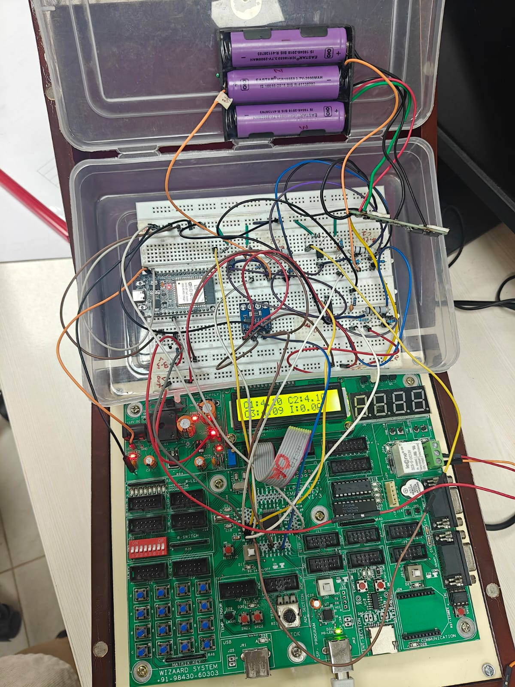
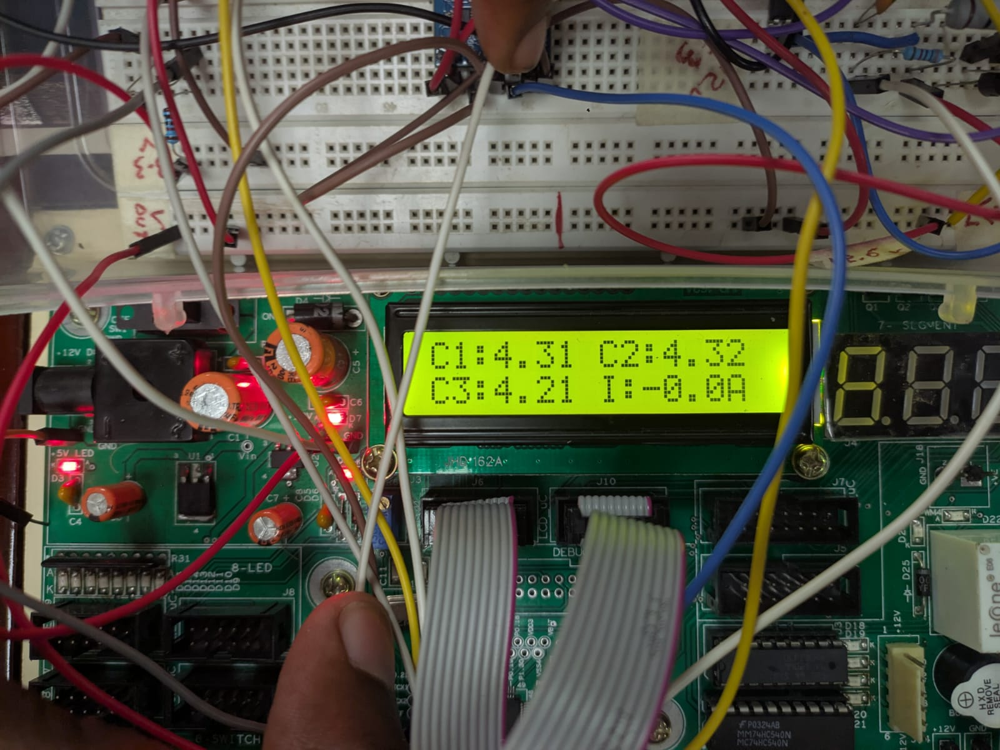
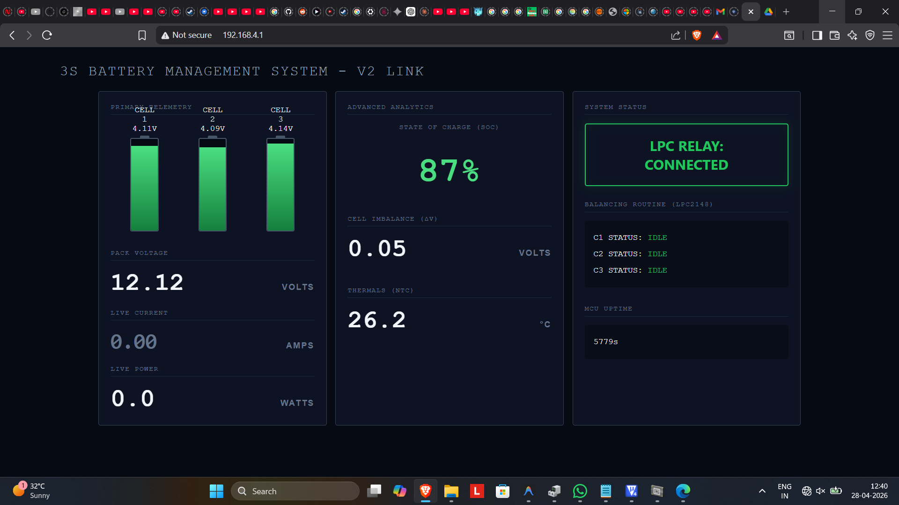
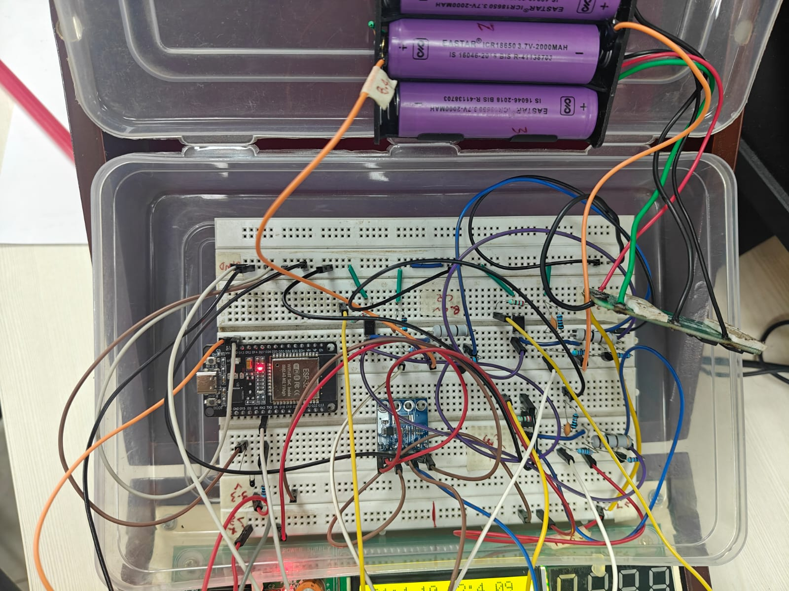
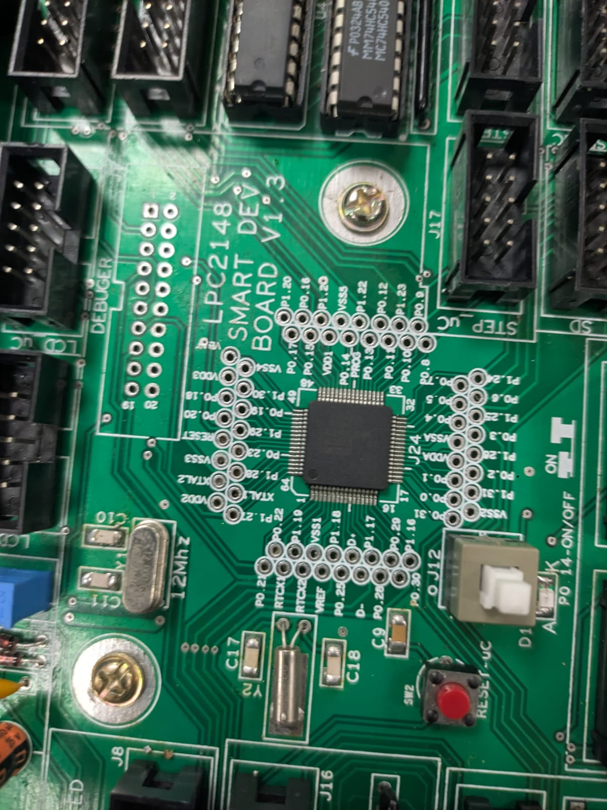
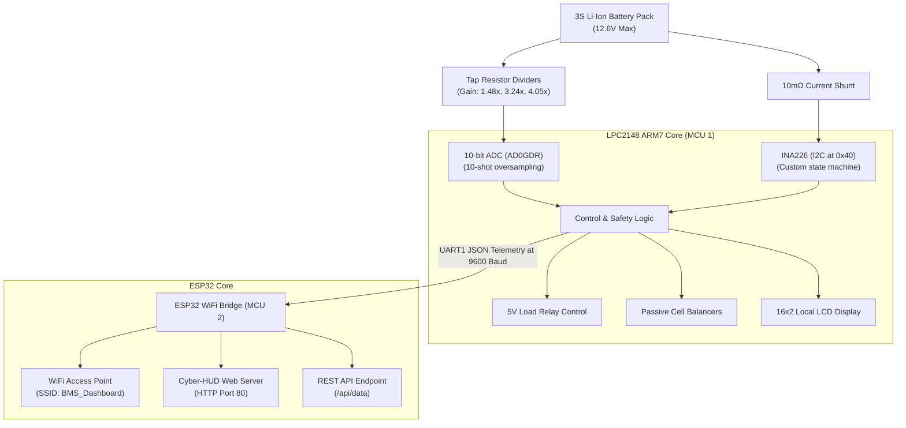

# 🔋 Battery Management System (3S Li-Ion)

> A complete battery management system for a 3-cell series Lithium-Ion pack featuring dual-threshold under-voltage lockout, passive cell balancing, and a live IoT dashboard — built from scratch with an LPC2148 ARM7 core and an ESP32 WiFi bridge.

### 🎥 Dashboard Live Demo

🔗 **[Click here to play the BMS Dashboard Live Demo Video](images/bms_demo.mp4)**

### 📸 Physical Build & Web Dashboard Gallery

| Full Hardware Setup | Active LCD Display | Web Cyber-HUD |
| :---: | :---: | :---: |
|  |  |  |

| Hardware Board Close-up | LPC2148 Pin Configuration |
| :---: | :---: |
|  |  |

---

## ⚡ Key Features

| Feature | Detail |
|---------|--------|
| **Dual-Threshold UVLO** | 8.5V cutoff under load (>150mA) to tolerate internal-resistance voltage sag; stricter 9.6V cutoff at idle |
| **Current Sensing** | INA226 via custom I2C state machine with NACK validation & 200K-cycle timeout |
| **Passive Balancing** | Bleeds cells >4.15V via optocoupler-driven bypass resistors; interlocked during active discharge |
| **EMI Hardening** | 10-shot ADC oversampling + 500µs balancer shutdown before every analog read |
| **IoT Web Dashboard** | Live dark-theme cyber HUD interface showing cell voltages, current, power, SoC, and relay status |
| **Overcurrent Protection**| Safety cutoff at 8.0A; Overvoltage cutoff at 12.7V pack |
| **Thermal Monitoring** | NTC thermistor with Steinhart-Hart equation execution (β=3950) |

---

## 🏗️ System Architecture



> **Design Paradigm:** Safety-critical sensing and protection loops run entirely on the LPC2148. The ESP32 serves as a decoupled display bridge — if WiFi fails or ESP32 resets, hardware battery protection remains active.

---

## 🔧 Hardware Configuration

| Component | Role | Interface |
|-----------|------|-----------|
| **LPC2148 ARM7** | Main safety-critical controller | — |
| **ESP32 DevKit V1** | WiFi IoT telemetry bridge | UART1 (P0.8 TX → GPIO16 RX) |
| **INA226** | Shunt current & bus voltage monitor | I2C (0x40 / 0x80 shifted, P0.3 SDA / P0.2 SCL) |
| **3S Li-ion pack** | Battery under test | Tap resistor dividers to ADC channels |
| **3× Optocouplers** | Cell balancing electrical isolation | P1.16, P1.17, P1.18 |
| **NTC 10kΩ Thermistor**| Temperature sensing | P0.25 (AD0.4) with 10kΩ pull-up |
| **16×2 LCD** | Local system status display | P0.16–P0.22 (parallel mode) |
| **5V Relay Module** | Load disconnect switch | P0.11 (active HIGH) |

### Voltage Divider Calibration

| Tap | Gain | Resistors | Calibration Multiplier |
|-----|------|-----------|----------------------|
| **Tap 1 (Cell 1)** | ×1.4769 | 4.65kΩ / 9.75kΩ | 0.9933 |
| **Tap 2 (Cell 1+2)** | ×3.2359 | 21.8kΩ / 9.75kΩ | 0.9864 |
| **Tap 3 (Pack)** | ×4.0461 | 29.7kΩ / 9.75kΩ | 0.9981 |

*Calibration multipliers are computed using `calibrate_bms.py` — an interactive command-line tool comparing raw LCD ADC readings against reference multimeter measurements.*

---

## 🧠 Core Software Algorithms

### 1. Protection Logic
```text
IF current > 8.0A OR pack_voltage > 12.7V → RELAY OFF (Fault)
ELSE IF discharging (current > 150mA)     → Cut at 8.5V (Tolerates sag under load)
ELSE (idle)                                → Cut at 9.6V (True empty pack threshold)
```

### 2. Passive Balancing & EMI Quiet Window
* Any cell exceeding **4.15V** triggers its respective optocoupler to bleed charge.
* **Interlock:** Balancing is strictly disabled if the pack is actively discharging (>150mA) to prevent measurement sag and thermal build-up.
* **EMI quiet window:** Switching cells under bypass injects high-frequency noise into the shared analog lines. The firmware implements a **500µs quiet window** where all balancers are disabled before starting ADC sweeps, restoring their state immediately after the measurements are complete.

### 3. INA226 I2C State Machine
The I2C driver is written as a rigid state machine validating bus statuses at every stage (`0x18` → `0x28` → `0x40`) with a 200,000-cycle timeout. On bus errors, the function returns a clean 0 instead of entering infinite blocks — resolving a critical **−8.1A phantom current bug** caused by breadboard EMI.

---

## 📁 Repository Structure

📂 **`LPC2148_Firmware_V2/`** — Active ARM7 safety-critical control firmware (Keil µVision)  
  * `main.c` — Core BMS protection loop & safety logic  
  * `debug_adc.c` — Standalone hardware ADC & NTC tap voltage diagnostic tool  
📂 **`ESP32_Dashboard_V2/`** — Active ESP32 WiFi web cyber-HUD source code (Arduino IDE)  
  * `ESP32_Dashboard_V2.ino` — Core telemetry bridge and dashboard host  
📂 **`images/`** — High-resolution photos, pin configuration, and live video demo  
  * `bms_full.jpg` — Complete hardware system setup  
  * `bms_close.jpg` — Detailed close-up of the LPC2148 hardware board  
  * `bms_lcd.jpg` — Close-up of the 16x2 LCD showing voltage taps in real-time  
  * `dashboard.png` — Real web cyber-HUD telemetry dashboard interface  
  * `bms_demo.mp4` — Asynchronous video demonstration of active load protections  
  * `LPC2148_pinout.jpeg` — Microcontroller pin configuration reference guide  
📄 **`calibrate_bms.py`** — Interactive software voltage divider calibration tool (Python)  
📄 **`MCI_v3.pdf`** — Complete hardware system schematic (Main Circuit Diagram)  
📄 **`README.md`** — Core project documentation  

---

## 🚀 Getting Started

### Prerequisites
- **Keil µVision 5** with LPC2000 target support package
- **Flash Magic** utility (ISP via serial)
- **Arduino IDE** with ESP32 board package

### Flashing LPC2148
1. Open Keil µVision and build `LPC2148_Firmware_V2/main.c` to generate the `.hex` file.
2. Connect LPC2148 via USB-to-UART converter. Open Flash Magic.
3. Select COM port, 9600 baud, and device **LPC2148**.
4. Trigger the hardware ISP sequence: **Hold ISP button ➔ Tap RESET ➔ Release ISP**, then click **Start** in Flash Magic.

### Flashing ESP32
1. Open `ESP32_Dashboard_V2/ESP32_Dashboard_V2.ino` in the Arduino IDE.
2. Select **ESP32 Dev Module** and click **Upload**.

---

## 🔬 Lessons Learned & V1 ➔ V2 Evolution

1. **The −8.1A Phantom Current** — Long I2C wire runs and breadboard capacitance caused intermittent bus corruption, translating to erroneous INA226 current register reads. Rewriting the entire I2C driver as a rigid status-validated state machine with timeouts resolved the lockups.
2. **ADC Infinite Hangs** — V1 firmware polled individual `AD0DR` channel registers, which could hang the main execution loop if a channel was skipped. V2 utilizes the `AD0GDR` global data register with single-shot DONE-bit verification.
3. **UART0 ISP Conflict** — P0.0 and P0.1 are shared with the ISP programming interface. During code uploads, telemetry traffic caused conflicts with Flash Magic. Migrated all JSON telemetry to the independent **UART1** bus (P0.8 / P0.9).
4. **Load-Aware UVLO** — Single-threshold voltage cutoffs cause false trips when motor loads drop battery terminal voltage momentarily. Implementing load-aware thresholds (relaxed 8.5V under load, strict 9.6V at idle) stabilized operations.

---

## 👤 Author

**Balaji Rayudu S**  
B.Tech Electronics & Computers Engineering, Semester IV  
Amrita Vishwa Vidyapeetham, Bengaluru
